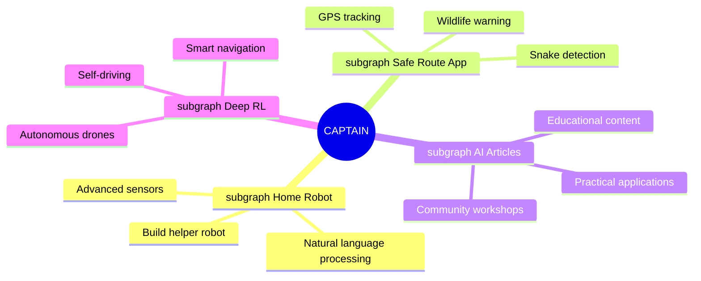

<div align="center">
  
# ⚡️ KYAPUTAN | THE CAPTAIN ⚡️

[](https://git.io/typing-svg)


[](https://github.com/kyaputan)
[](https://twitter.com/kyaputan)

</div>

---

<div align="center">
  
##  **สวัสดีชาวโลก! I'M CAPTAIN** 

</div>

> ***"The future belongs to those who build it with their own code."*** 💯

<div align="center">
  
  
  
</div>

###  **จากใจของกัปตัน...**

```javascript
const captain = {
    pronouns: "He" | "Him",
    code: ["Python", "JavaScript", "GO", "Arduino", "HTML/CSS"],
    technologies: {
        AI: ["TensorFlow", "PyTorch", "OpenCV", "Deep Learning"],
        robotics: ["Raspberry Pi", "Arduino"],
        smartHome: ["Home Assistant", "MQTT", "ESP32"],
        frontend: ["React", "Bootstrap"],
        backend: ["Flask", "Django", "Node", "Express"],
        databases: ["MongoDB", "MySQL"],
    },
    lifeGoal: "Combine AI, robotics, and smart systems to improve human lives",
    favoriteQuote: "The best way to predict the future is to create it."
};
```

---

<div align="center">

# 🚀 **SKILLS & TECHNOLOGIES** 🚀

</div>

<div align="center">
  
## 💻 **PROGRAMMING LANGUAGES**


## 📊 **DATA PREPARATION**


## 📈 **DATA VISUALIZATION**


## 🔧 **FEATURE ENGINEERING**


## 🛠️ **TOOLS & PLATFORMS**


## 🗄️ **DATABASE & BACKEND TECHNOLOGIES**


## 🌐 **WEB FRAMEWORKS & LIBRARIES**


</div>

---

<div align="center">

# 📊 **GITHUB STATS** 📊

[](https://git.io/streak-stats)

<a href="https://github.com/kyaputan/github-readme-stats">
  
</a>
<a href="https://github.com/kyaputan/convoychat">
  
</a>


</div>

---

<div align="center">

# 🚀 **FUTURE AMBITIONS** 🚀



</div>

---

<div align="center">

# 📞 **CONNECT WITH ME** 📞

[](mailto:singkhet1@gmail.com)
[](https://github.com/kyaputan)
[](https://www.linkedin.com/in/rachata-singkhet-20bb601b0/)
[](https://twitter.com/kyaputan)
[](https://youtube.com/kyaputan)
[](https://discord.gg/captain)

</div>

---
<div align="center">

# 👨‍🚀 **THANK YOU FOR VISITING!** 👨‍🚀


</div>
