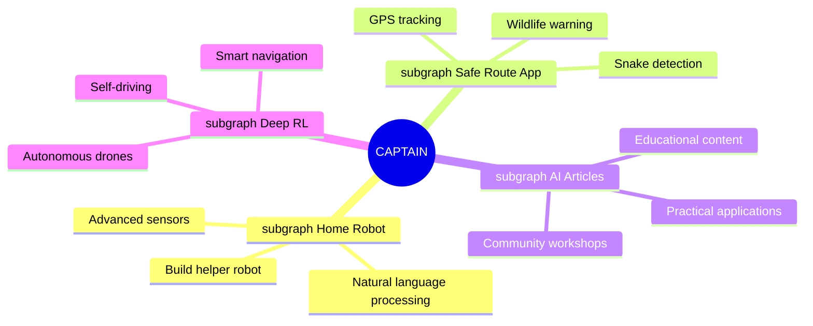

<div align="center">
  
# ⚡️ KYAPUTAN | THE CAPTAIN ⚡️

[](https://git.io/typing-svg)


[](https://github.com/kyaputan)

</div>

---

<div align="center">
  
##  **สวัสดีชาวโลก! I'M CAPTAIN** 

</div>

> ***"The future belongs to those who build it with their own code."*** 💯

<div align="center">
  
  
  
</div>

###  **จากใจของกัปตัน...**

```Python
class Captain:
    def __init__(self):
        self.name = "Captain"
        self.code = ["Python", "JavaScript", "GO", "Arduino", "HTML/CSS"]
        self.technologies = {
            "AI": ["TensorFlow", "PyTorch", "OpenCV", "Deep Learning"],
            "robotics": ["Raspberry Pi", "Arduino"],
            "smartHome": ["Home Assistant", "MQTT", "ESP32"],
            "frontend": ["React", "Bootstrap"],
            "backend": ["Flask", "Django", "Node", "Express"],
            "databases": ["MongoDB", "MySQL"],
        }
        self.life_goal = "Combine AI, robotics, and smart systems to improve human lives"
        self.favorite_quote = "The best way to predict the future is to create it."

    def introduce(self):
        return f"Hi, my pronouns are {self.name}."
               f"My goal is: {self.life_goal}." 
               f"Favorite quote: {self.favorite_quote}."
```

---

<div align="center">

# 🚀 **SKILLS & TECHNOLOGIES** 🚀

</div>

<table align="center" style="width: 100%; table-layout: fixed;">
  <tr>
    <th style="text-align: center;">Programming Languages</th>
    <th style="text-align: center;">Feature Engineering</th>
    <th style="text-align: center;">Database & Backend Technologies</th>
    <th style="text-align: center;">Web Frameworks & Libraries</th>
  </tr>
  <tr align="center">
    <td style="text-align: center;"></td>
    <td style="text-align: center;"></td>
    <td style="text-align: center;"></td>
    <td style="text-align: center;"></td>
  </tr>
  <tr align="center">
    <td style="text-align: center;"></td>
    <td style="text-align: center;"></td>
    <td style="text-align: center;"></td>
    <td style="text-align: center;"></td>
  </tr>
  <tr align="center">
    <td style="text-align: center;"></td>
    <td style="text-align: center;"></td>
    <td style="text-align: center;"></td>
    <td style="text-align: center;"></td>
  </tr>
  <tr align="center">
    <td style="text-align: center;"></td>
    <td style="text-align: center;"></td>
    <td style="text-align: center;"></td>
    <td style="text-align: center;"></td>
  </tr>
</table>


---

<div align="center">

# 📊 **GITHUB STATS** 📊

[](https://git.io/streak-stats)

<a href="https://github.com/kyaputan/github-readme-stats">
  
</a>
<a href="https://github.com/kyaputan/convoychat">
  
</a>

</div>

---

<div align="center">

# 🚀 **FUTURE AMBITIONS** 🚀



</div>

---

<div align="center">

# 📞 **CONNECT WITH ME** 📞

[](mailto:singkhet1@gmail.com)
[](https://github.com/kyaputan)
[](https://www.linkedin.com/in/rachata-singkhet-20bb601b0/)


</div>

---
<div align="center">

# 👨‍🚀 **THANK YOU FOR VISITING!** 👨‍🚀


</div>
